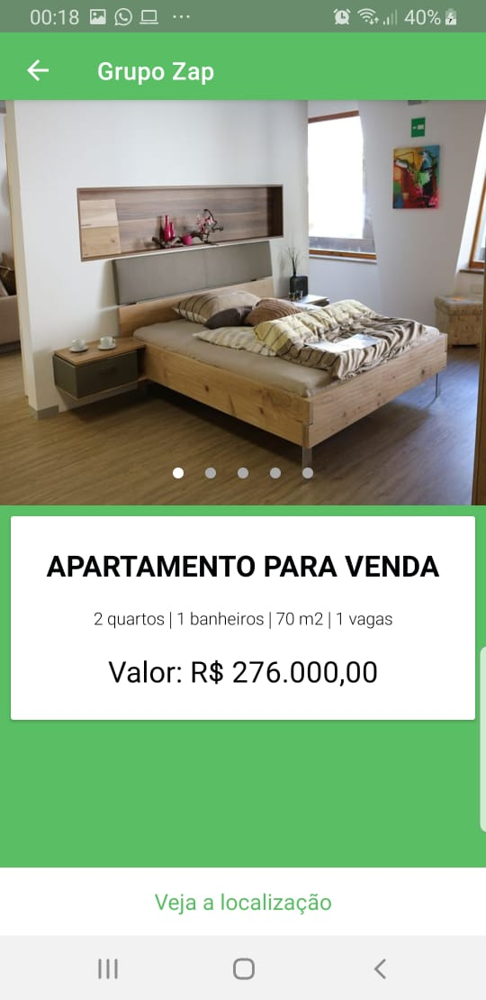
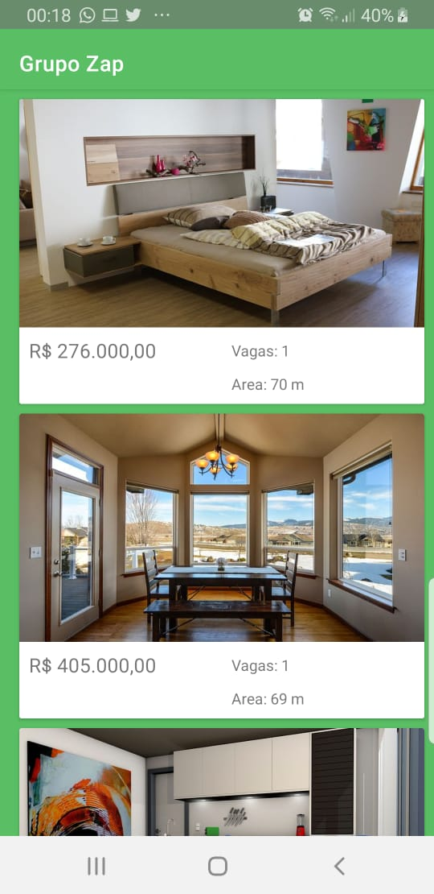

# PlayGroundMVVM
  
 
## Table of Contents
* [ScreenShots](#screenshots)
* [Libs](#libs)
* [Tools](#tools)
* [OBS](#obs)

## Screen Shots

  
  
  

##  Libs
* [Kotlin](https://kotlinlang.org/)✔︎
* [Architecture Components - ViewModel](https://developer.android.com/topic/libraries/architecture/viewmodel)✔︎
* [Architecture Components - Databinding](https://developer.android.com/topic/libraries/data-binding)✔︎
* [RxJava](https://github.com/ReactiveX/RxJava)✔︎
* [Retrofit](http://square.github.io/retrofit/)✔︎
* [ViewPager2](https://developer.android.com/jetpack/androidx/releases/viewpager2)✔︎
* [Picasso](http://square.github.io/picasso/)✔︎
* [AndroidX Support Libs ](https://developer.android.com/jetpack/androidx) ✔︎
* [Dagger](https://github.com/google/dagger)✔︎
* [Gradle Kotlin DSL](https://docs.gradle.org/current/userguide/kotlin_dsl.html)✔︎
* [Instrumented Test - Espresso](https://developer.android.com/training/testing/espresso/index.html)✔︎
* [UnitTest - Mockk](https://github.com/mockk/mockk)✔︎
* [Pipeline - Actions](https://docs.github.com/en/actions/reference/workflow-syntax-for-github-actions#about-yaml-syntax-for-workflows)✔︎

##  Tools

* [Modularization]
* [Pipeline]
* [UnitTest]
* [Instrumented Test]
* [List]
* [Detail]
* [Splash]
* [Call Google Maps]

## OBS
 * Como eu apenas um Samsung, todo o desenvolvimento foi feito pelo emulador ( alguns modelos ) + o meu próprio, não sabendo como ir
 a se compartar com aparelho como XIAOMI
 * Poderia ter feito mais coberturas e adicionado mais campos na tela, só que não considerei necessário, pois assim já consigo demonstrar meu conhecimento.
 * Podemos conversar sobre quaisquer pontos que tenham duvida
 * Não quis configurar a chave de release e nem o fabric, mas caso tenham duvida eu explico como faz para tirar qualquer duvida de implementação da minha parte.
 * Sobre a parte que estava escrito no desafio de diferenciar Viva real ou Zap, pra mim ficou um pouco confuso que pareceu ser mais o desafio de backend, e como também não vi nada no json eu acabei descondiderando. Todo caso eu tenho algumas abordagens que podemos discutir caso isso seja necessário também.
    
License
-------

    Copyright 2020 Rodrigo Vianna

    Licensed under the Apache License, Version 2.0 (the "License");
    you may not use this file except in compliance with the License.
    You may obtain a copy of the License at

    http://www.apache.org/licenses/LICENSE-2.0

    Unless required by applicable law or agreed to in writing, software
    distributed under the License is distributed on an "AS IS" BASIS,
    WITHOUT WARRANTIES OR CONDITIONS OF ANY KIND, either express or implied.
    See the License for the specific language governing permissions and
    limitations under the License.
